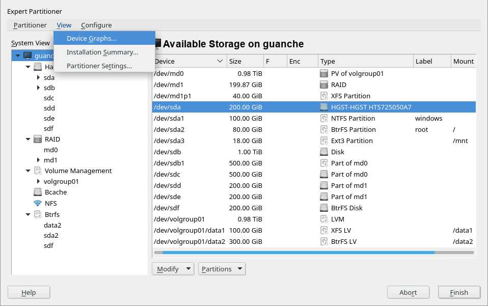

# YaST Partitioner - Partial demo of a minimal menu

This branch of yast-storage-ng is only useful if you want to play a bit with the
sketch of the minimal menu bar.

Execute the demo (that mocks some disks, partitions, MD and LVM devices) by
running this (it's a one-liner bash).

```
./demo.sh
```

The menu only contains general actions that are independent of the device currently
selected. All actions should work as expected.


