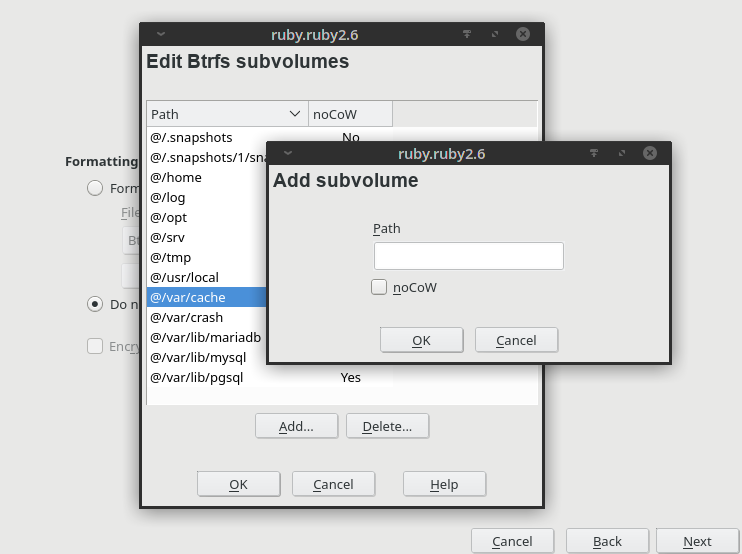

## Btrfs features to implement in 15.3

This is part of the [bigger document](../partitioner_ui.md) about rethinking the YaST Partitioner
user interface.

### Btrfs subvolumes 101

Subvolumes are a very special feature of Btrfs that is not present in any other Linux filesystem.
Each Btrfs filesystem can contain several subvolumes, defined in the [corresponding Btrfs
documentation](https://btrfs.wiki.kernel.org/index.php/SysadminGuide) as "_independently mountable
POSIX filetree that are not a block device (and cannot be treated as one)_".

Btrfs subvolumes can be nested inside each other. In fact, all Btrfs filesystems contain a top-level
subvolume (with Btrfs id 5) containing all the files, directories and other subvolumes. Thus, each
subvolume except the top-level one has a parent subvolume. In addition, many SUSE products define an
extra subvolume named "@" as an extra top-level container. Last but not least, filesystems snapshots
are also implemented as subvolumes nested into an special subvolume called ".snapshots". As a
result, the structure of subvolumes of a SUSE Btrfs filesystem can look like this.

```
toplevel
\-- @
    +-- @/home
    +-- @/var
    |    +-- @/var/cache
    |    \-- @/var/lib/libvirt
    +-- @/tmp
    \-- @/.snapshots
         +-- @/.snapshots/1/snapshot
         \-- @/.snapshots/2/snapshot
```

Each subvolume can have its own configuration in many aspects. That includes its mount options
(every subvolume is somehow seen by the system as a filesystem on its own), its Copy on Write (CoW)
operation mode, its usage quotas and (in extreme cases) even its own RAID mode.

Last but not least, a given set of subvolumes can become "shadowed" if a separate filesystem is
mounted in a way that makes them not longer relevant. For example, imagine a root Btrfs filesystem
with the subvolumes `/home`, `/var/lib` and `/var/cache`. If a separate partition is then formatted
and mounted in `/var`, two of the subvolumes will become irrelevant because they cannot be accessed.

### Group quotas 101

In the past, it was common to use separate partitions with their own filesystems for `/var`, `/tmp`
and `/home` (among other directories) as a way to ensure the root filesystem couldn't be 100% filled
due to the growth of one of the mentioned directories.

With Btrfs the usual approach is to have a single filesystem with the relevant subdirectories as
subvolumes. The mechanism to limit the space a given subvolume can consume is the usage of Btrfs
quota groups. If such optional Btrfs feature is enabled, each subvolume (including the snapshots) is
by default associated to a quota group, short qgroup. It is possible to set limits on those qgroups,
which effectively limits the space used by the corresponding subvolumes.

But quota groups go far beyond limiting the space of each subvolume. The user can define more
qgroups organized in hierarchical levels for different purposes.  Detailing all the possible
organizations of qgroups and its association to the subvolumes is out of the scope of this document,
but it's definitely something to take into account when thinking about representing the quotas in
the Partitioner user interface.

As a side note, activating support for quota groups for a Btrfs filesystem makes it possible to know
how much space will be freed by deleting a particular snapshot, something that is not easy to
predict without the usage of qgroups.

Last but not least, it's worth mentioning that currently Btrfs quota groups are known to be rather
buggy and to cause a noticeable performance penalty, specially when used in a filesystem with many
snapshots.

### Support for subvolumes in the 15.2 Partitioner

Managing the Btrfs subvolumes is, as a matter of fact, one of the areas in which the current
approach of the Partitioner fails.

The list of subvolumes for a given filesystem can be displayed by clicking in the  "Subvolume
Handling" button when editing that filesystem.



In such pop-up driven interface the "@" subvolume is not represented at all, since there is nothing
like nesting in that UI (apart from the nesting that can be inferred by the subvolume paths).
Instead of clearly representing such special subvolume, a "@" character is automatically added to
each new subvolume, pretending it's just a prefix. The way that "prefix" is managed turns to be
quite confusing (and usually bogus when editing a filesystem that does not contain such special
subvolume).

There is no visual indication of which subvolume is the default one (not to be confused with the
toplevel subvolume) or other relatively important properties of the subvolumes like their ids, their
mount options, etc. Only the "noCow" property is somehow hammered into the interface.

The snapshoting feature of Btrfs is heavily based on subvolumes. But that connection is not visible
at all in the Partitioner. If during installation the "Enable Snapshots" is checked, a `.snapshots`
subvolume will be created in the root filesystem. But that subvolume is not visible in the
corresponding list.

It has also been requested to offer an understandable mechanism in the Partitioner to limit the
space used by each subvolume. As explained above, that implies representing somehow the quota groups
that exist or that are going to be created in the filesystem. For each subvolume (that is, for each
associated qgroup) it would be necessary to display the usage of _referenced_ and _exclusive_ space
and the limit for both, allowing to modify those limits.

Last but not least, the management of shadowed subvolumes is not exactly intuituve, with many things
happening behind user's back. If a subvolume becomes shadowed, it will simply disappear from the
list with no trace and will re-appear as soon as the device that was shadowing it is modified or
deleted.
